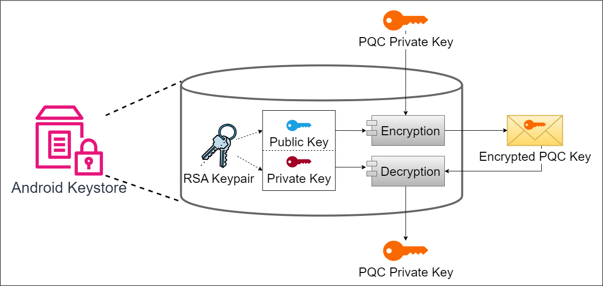
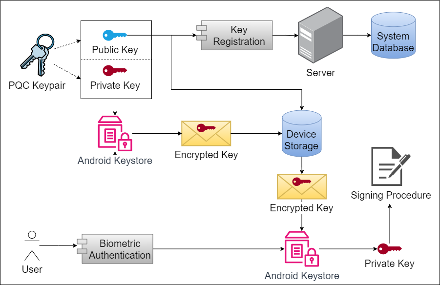
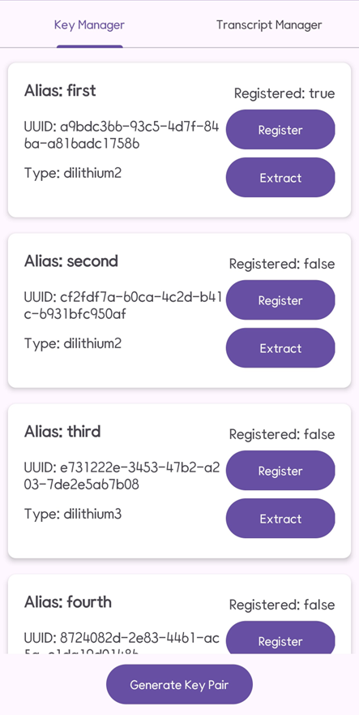
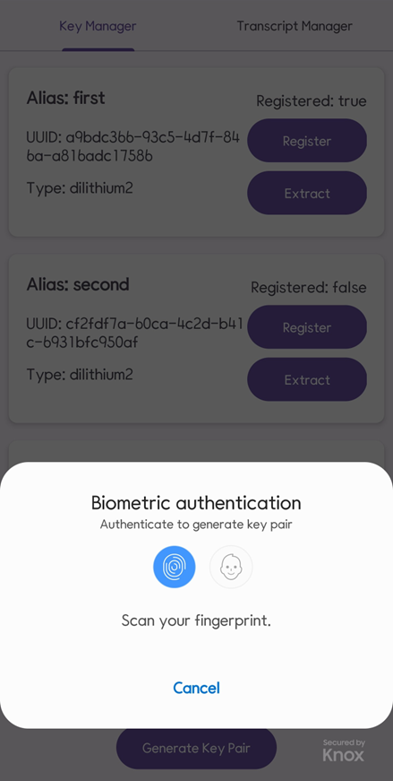
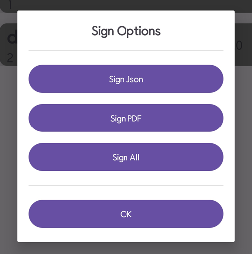
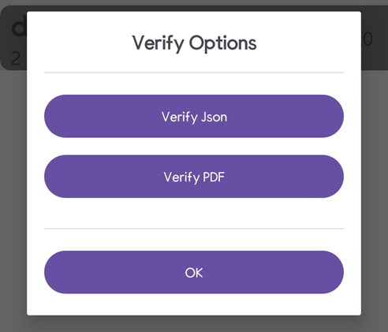

# Digital Signature App using Post Quantum Cryptography

## General

This is my final graduation project at Ha Noi University of Science and Technology, done under the guidance of master Bui Trong Tung.

## Description

This app allow user to generate and store private keys at their personal devices, also they can extract and bring it to another devices.

Not only that, it uses Post Quantum Cryptography for the signing procedure, prevent the attack of Quantum Computer in the future. 

## Solution Design

Here is my keypair storing solution and general flow for this project:

## Structure

This project consists of two main modules: 
- Android app (in App folder): written in Java
- Web server (in WebServer folder): written in NodeJs

The steps to run each module are provided within their respective folders.

## App Preview

|||
|:---:|:---:|
|||
|Key Manager screen|Biometric authentiation required|
|||
|Sign options|Verify options|

